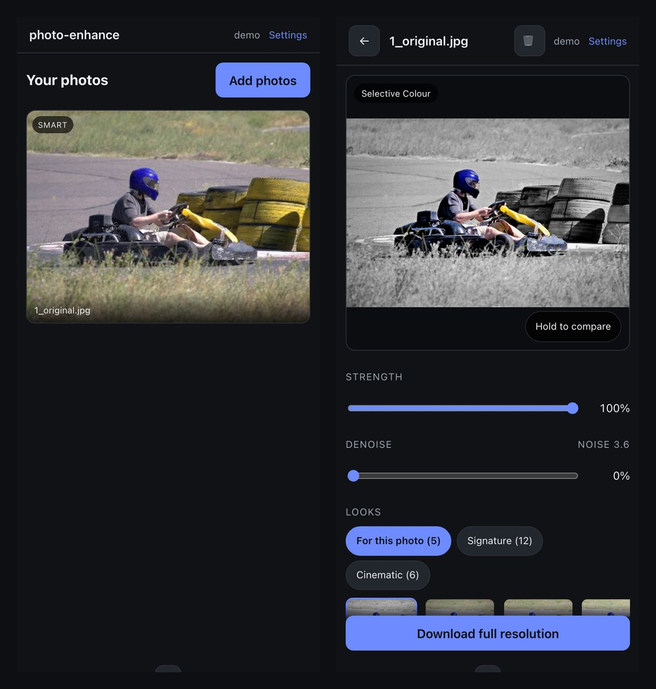

<div align="center">

# photo-enhance

---

### Automatic photo enhancement on your own server — five neural networks, no subscription, and nothing leaves your machine.

[](LICENSE)
[](#the-models)
[](#running-it)
[](#docker-recommended)
[](https://github.com/Akopmm/photo-enhance/actions)

**[Quick start](#docker-recommended)** · **[Report a bug](https://github.com/Akopmm/photo-enhance/issues/new?labels=bug)** · **[Request a feature](https://github.com/Akopmm/photo-enhance/issues/new?labels=enhancement)** · **[Buy me a coffee](https://buymeacoffee.com/akopmm)**

</div>

---

A self-hosted photo enhancement service. Point it at a photo — Canon CR3, Sony ARW, or plain JPEG — and it predicts a colour/exposure correction with a small neural network, then renders **18 style variants** on top of it. In *enhanced* mode it also segments the photo — subject, sky, foliage and depth — so those can be graded separately, and suggests compositional crops.

Runs on a home server. Nothing leaves the machine.

Built to replace a monthly photo-editing subscription.


*Every panel above is a real intermediate from one Canon CR3 — including the three masks, which are
what BiRefNet, UPerNet and Depth Anything actually produced on that frame. Timings measured on the
deploy box, a six-core i5-10500T with UHD 630 graphics.*

---

## What it actually does to a photo

Every image below is a real output, not a mock-up.

**One photo, seven looks.** The base correction plus region-aware recipes — the subject, the sky and
the foliage are graded separately, so "Selective Colour" can drop the background to mono while the
bird keeps its colour.


**Small subjects still get found.** Here the bird is 0.87% of the frame. An earlier version's 1%
floor rejected it and offered nothing but global styles.


**Soft alpha is the whole point of using BiRefNet.** A hard threshold destroys the graded edge that
makes hair and feathers survive a region grade.


And the same edge at full resolution, where the colour meets the mono background — a hard cut with a
fixed 2.5px feather, against soft alpha with the feather scaled to the image:


**Halos were a real bug, and the fix is measured.** `dehaze` used a fixed-radius blur, which is 1.67%
of a 480px preview but 0.13% of a 6000px render — so the preview and the download disagreed, and wide
mattes left a bright rim around the subject.


---

## How it works

### The models

A small CNN (~600K parameters) based on [*Learning Image-Adaptive 3D Lookup Tables for High Performance Photo Enhancement in Real-time*](https://github.com/HuiZeng/Image-Adaptive-3DLUT) (Zeng et al.). It looks at a downsampled copy of the photo and predicts how to blend a handful of learned 3D colour lookup tables into one image-specific correction.

`service/weights/model.pt` ships **that paper's own published pretrained weights** (sRGB variant, converted into this repo's state-dict layout; originals from the authors' `pretrained_models/sRGB/`). The LUT application is reimplemented with `torch.nn.functional.grid_sample` instead of the original repo's CUDA-only compiled extension, so the identical model runs on plain CPU, Apple Silicon (MPS) or an Intel iGPU (OpenVINO) with no GPU-specific build step.

> If you reimplement this: the LUT axis order is **B, G, R** across the tensor's first three spatial axes (R varies along the *last*). Getting it backwards still trains fine — it's self-consistent — but the published weights then produce garbage. Verified against the original repo's own `IdentityLUT33.txt`.

### Styles (both modes)

18 deterministic looks in `service/presets.py` and `service/cinematic.py`, applied on top of the model's corrected baseline. Hand-tuned parameters, not learned:

**Core (12)** — Natural Light+, HDR Punch, Cinematic Teal-Orange, Golden Hour Warm, Moody Matte Film, B&W Dramatic, Clean Commercial, Vibrant Punch, Bright & Airy, Faded Retro, Deep Contrast Noir, Cool Arctic.

**Cinematic pack (6)** — Teal & Orange, Bleach Bypass, Midnight Blue, Warm Film, Cold Thriller, Golden Epic. What reads as "cinematic" is a small set of ingredients: a filmic curve (lifted blacks, rolled highlights), split toning, restrained saturation, halation and grain. No model involved; toggleable in settings.

### Region-aware grading (enhanced mode)

The LUT model applies **one** colour mapping to every pixel, so it structurally cannot treat a subject differently from its background. Segmentation supplies the *where*:

| Mask | Model | Notes |
|---|---|---|
| Subject | [BiRefNet-lite](https://github.com/zhengpeng7/birefnet), 44M params | Crisp cutouts; the "Select Subject" equivalent |
| Sky / scene | [UPerNet / ConvNeXt-tiny](https://huggingface.co/openmmlab/upernet-convnext-tiny), 60.2M params | ADE20K's 150 classes: the sky mask, the foliage union (tree ∪ grass ∪ plant), and the scene inventory that decides which looks are offered at all |
| Depth | [Depth Anything V2 Small](https://huggingface.co/depth-anything/Depth-Anything-V2-Small-hf), 24.8M params | Grades by distance rather than by object, so it still works where subject segmentation finds nothing |

UPerNet/ConvNeXt-tiny replaced SegFormer-B0 here. Compared before swapping, on the masks the service
actually consumes: foliage IoU 0.82/0.92 across two photos, and while sky scored IoU 0.31, by eye
UPerNet is the better of the two — SegFormer's sky came out patchy and leaked into blurred
foreground. Costs 60M params against 3.8M, once per import.

### Denoise

[SCUNet](https://github.com/cszn/SCUNet), the authors' **real-noise** model rather than a
synthetic-Gaussian one — which is why it holds up on an actual high-ISO CR3. Measured on one: sigma
4.0 → 0.8 across the frame and 8.1 → 0.3 at 1:1, with eyelashes and catchlights intact.

`denoise_mode: auto` (default) measures the corrected baseline and only denoises above sigma 3, so
clean frames are neither softened nor charged for it. This is the most expensive model in the service
— unlike the others it has no internal downsampling — and a noisy import costs ~87 s on the deploy box
against ~15 s for a clean one.

**The amount is a live slider** because both baselines are stored, untouched and fully denoised: any
amount is a blend between them, so it responds in ~46 ms with no model run. Full-resolution renders
tile the model with feathered overlap (measured 0.14/255 mean difference from a single pass) and blend
to the same amount — a denoised preview with a noisy download would be the same divergence bug the
masking rework removed.

Recipes: **Selective Colour** (subject in colour, background mono), **Subject Pop**, **Sky Drama**, **Depth Pop**, **Aerial Depth**, **Foliage**. Only the ones the photo can actually support are offered — Aerial Depth needs outdoor content, Foliage needs greenery, and the depth looks need the scene to span a depth range at all.

**Masks are computed once and reused.** They are produced at 1024 px, persisted next to the import as PNG, and resampled to whatever the output needs. That is not a shortcut: BiRefNet resizes its input to 1024×1024 internally, so segmenting the full 6000 px image yields the same prediction upscaled. Previously the preview and the full-resolution download segmented independently and disagreed (measured 0.2120 vs 0.1873 sky coverage on one photo), so the file you downloaded was not the grade you approved.

Masking failures degrade to the ordinary global styles rather than failing the import. A recipe is skipped when the mask is degenerate — judged on **confidence as well as area**, because area alone cannot tell "found nothing" from "found something small": a bird on a wire covers 0.9 % of the frame and is exactly the photo Selective Colour is for.

**Region strength.** A slider on each import dials the region recipes back toward the ungraded image; the value is part of the render cache key. It attenuates the whole-frame layers too, not just the masks — in Selective Colour the mono conversion *is* a whole-frame layer, so scaling only the subject mask would leave the background fully black & white however far the slider was pulled back. Downloads take `?strength=0.0…1.0`.

### Crop suggestions (enhanced mode)

Built on the same subject mask, so it's arithmetic rather than guesswork: the subject's mass-weighted centroid is placed on the nearest rule-of-thirds intersection, across 1:1 / 4:5 / 3:2 / 16:9 / 2.39:1.

- Prefers keeping the subject whole; will offer a tighter crop that clips it, reporting `subject_coverage`, with intact crops ranked first.
- Filters out no-op crops (≥95% of the frame kept) and destructive ones (<60% of the subject).
- Each suggestion renders its own preview thumbnail, so the framing is visible before downloading. Downloads take `?crop=<key>`.

Deliberately rules, not a learned aesthetics model — that would be another ~100MB and seconds per photo to land in roughly the same place for the common single-subject case. With no clear subject it falls back to a centred crop and says so.

### The editor


Looks are grouped: the ones this photo can actually take (its region recipes), then the global
Signature and Cinematic sets. Strength dials a region recipe back toward the ungraded image, and
denoise is a live blend between two stored baselines, so moving either slider costs nothing.



It is built to be used from a phone — that is where you are when you want the photo.


Two screens: a **Library** of your photos, and an **Editor** you open one into. On a wide screen the
photo sits left and every control right, so you never scroll between the image and the thing that
changes it.

- **Looks** are a filmstrip grouped into *For this photo* (the region-aware ones, which depend on
  what the segmenters found), *Signature* and *Cinematic* — rather than one wall of 24 thumbnails.
- **Strength** and **Denoise** are sliders that re-render the large preview as you drag them. Both
  are arithmetic over things already computed, so they respond in tens of milliseconds with no model
  run: strength blends toward the ungraded baseline, and denoise blends between the two stored
  baselines (untouched and fully denoised).
- **Crop** is drawn *on* the photo — dimmed surround, thirds guides, corner handles. Drag inside to
  reposition, drag a corner to resize; that detaches from the preset and sends an explicit rectangle.
- Press and hold the image to compare against the original.

### Preview-first rendering

Decode and model inference run once at full resolution on import — both are cheap at any size, since
the weight-predictor CNN downsamples to 256×256 internally and the LUT is a pointwise op. Masks are
computed once at 1024 px and persisted; the baseline is stored at 1280 px so the editor's large
preview can be re-rendered from it at any look and strength and still be sharp.

Full-resolution renders happen only for what you actually **download**, run as a job with real
progress (`fetching → decoding → colour model → removing noise → applying the look → cropping →
saving`), and are cached by every parameter that affects the result. Deleting a photo cancels any
render still working on it.

### Output size and crops

Downloads can be **Original**, or ~5 / ~3 / ~1 MB. The resize happens straight after the colour
model, so denoise, styling and cropping all run smaller — on a 26 MP frame that is 140 denoise tiles
against 48. Sizes are labelled in MB and the encoder steps quality down until it fits, because a
denoised frame compresses far better than a noisy one.

Cropping likewise happens **before** the expensive stages rather than on the finished JPEG, which
also removes a second round of JPEG compression on every cropped download.

Crop presets lead with the ratios Instagram actually accepts — post outside this range and it
re-crops for you: **Story/Reel 9:16**, **Portrait 4:5** (the tallest allowed), **Square 1:1**,
**Landscape 1.91:1** (the widest allowed) — followed by 3:2, 16:9 and 2.39:1.

### Users

Login is stdlib-only — `hashlib.scrypt` for passwords, HMAC-signed session cookies. No auth framework for what is a handful of accounts on a private network.

Each user holds **their own** Immich URL and API key, so imports read from their own library. Galleries are per-user and every read path checks ownership rather than trusting UUIDs to be unguessable. API keys are never sent to any browser — only a masked preview — and submitting an empty key means "leave unchanged".

---

## Modes

| | classic | enhanced |
|---|---|---|
| Colour correction + 18 style presets | ✓ | ✓ |
| Subject / sky / foliage / depth region grading | — | ✓ |
| Crop suggestions | — | ✓ |
| Denoise (when the photo needs it) | — | ✓ |
| Import time, 26 MP CR3 (6-core i5-10500T) | ~5 s | ~15 s clean, ~87 s if denoised |
| Container peak while importing | ~1 GB | ~2.5 GB, ~4.5 GB if denoised |

Switch in **Settings**. Defaults to `classic`.

---

## Running it

### Docker (recommended)

There is a ready-made [`docker-compose.example.yml`](docker-compose.example.yml) at the repo root — copy it to `docker-compose.yml`, change the password, `docker compose up -d`.

> **Published image is `linux/amd64` only.** On arm64 (Apple silicon, Raspberry Pi, most ARM NAS boxes) build it yourself: `docker build -f service/Dockerfile -t photo-enhance .` from the repo root. The image also bundles an Intel GPU runtime that is dead weight on non-Intel hosts.

CI publishes `ghcr.io/akopmm/photo-enhance:latest` on every push to `main`, with the segmentation weights **baked in** — no cold-start download, no dependency on Hugging Face being reachable.

```bash
docker run -d --name photo-enhance -p 5054:5054 \
  -e PHOTO_ENHANCE_ADMIN_USER=you \
  -e PHOTO_ENHANCE_ADMIN_PASSWORD='a-long-password' \
  -v /srv/photo-enhance-data:/app/service/data/renders \
  ghcr.io/akopmm/photo-enhance:latest
```

Building locally — the build context must be the **repo root**, not `service/`, because the Dockerfile pulls in `shared/model.py`:

```bash
docker build -f service/Dockerfile -t photo-enhance .
```

> `torchvision` must be resolved from the same CPU index as `torch`. `timm` pulls it in transitively, and the default PyPI wheel is a CUDA build whose compiled ops don't match (`operator torchvision::nms does not exist`). The Dockerfile installs the pair together.

### From source

```bash
cd service
python3 -m venv .venv && source .venv/bin/activate
pip install torch torchvision --index-url https://download.pytorch.org/whl/cpu
pip install -r requirements.txt

# The denoiser's weights are baked into the Docker image but not committed
# here (72MB). Without this step everything works except denoising, and
# /health will say so: "denoise": {"weights": false}.
python -c "import hashlib,os,urllib.request as u; \
d='weights/scunet_color_real_psnr.pth'; os.makedirs('weights',exist_ok=True); \
u.urlretrieve('https://huggingface.co/deepinv/scunet/resolve/main/scunet_color_real_psnr.pth', d); \
h=hashlib.sha256(open(d,'rb').read()).hexdigest(); \
print('ok' if h.startswith('fa78899ba2caec9d') else 'CHECKSUM MISMATCH')"

uvicorn main:app --host 0.0.0.0 --port 5054
```

The segmentation and depth models download themselves from Hugging Face on the first
*enhanced*-mode import (~250MB, once).

### First run

The instance starts with no users. Either set `PHOTO_ENHANCE_ADMIN_USER` / `PHOTO_ENHANCE_ADMIN_PASSWORD`, or just open the page — the login screen offers a one-time "create admin" form. That form refuses once any user exists.

Then, in **Settings**, add your Immich URL and an API key scoped to `album.read`, `asset.read`, `asset.view`, `asset.download`.

Everything else — mode, masking toggles, concurrency, JPEG quality, users — is editable there and persisted to `data/renders/_config/` **inside the mounted volume**, so it survives image updates.

> Keep that config path inside the volume. An earlier version wrote it to the volume's *parent*, which lives in the container's ephemeral layer, so every update silently wiped all users, their API keys and the session secret — while login still appeared to work, because the admin re-bootstraps from env.

### Configuration

| Variable | Default | Notes |
|---|---|---|
| `PHOTO_ENHANCE_ADMIN_USER` / `_PASSWORD` | — | Bootstraps the first admin only |
| `RENDER_STORAGE_DIR` | `service/data/renders` | Renders **and** config |
| `MAX_CONCURRENT_JOBS` | `2` | Whole-pipeline gate, decode included |
| `DENOISE_DEVICE` | `auto` | `auto` / `cpu` / `gpu`. **Set `cpu` on an Intel iGPU host with <16GB RAM** — see below |
| `IDLE_UNLOAD_MINUTES` | `15` | Drops the model when idle |
| `INFERENCE_DEVICE` | `cpu` | or `openvino_cpu` / `openvino_gpu` |

On concurrency: the gate covers the **entire** pipeline. An earlier version only locked the model call while RAW decode ran unbounded on the default thread pool, so ~30 concurrent imports meant ~30 simultaneous full-resolution decodes (~250-400MB each) and pegged the host. Segmentation has its own stricter `Semaphore(1)` on top.

`INFERENCE_DEVICE=openvino_gpu` (with `/dev/dri` passed through) routes the colour model through an Intel iGPU. An earlier note here claimed this was "no faster than CPU" — **that measurement was invalid**: it was taken with no Intel compute runtime installed, so OpenVINO reported no GPU and silently ran on CPU. It was comparing CPU against CPU. Untested since.

The denoiser is the one model where the iGPU clearly pays: **5.67 → 3.39 s** per 512 px tile on a UHD 630. Two things to know before enabling it:

> ⚠️ **`DENOISE_DEVICE=auto` needs ~16GB of RAM on an Intel iGPU host.** Compiling SCUNet for OpenVINO calls `ov.convert_model`, which peaks **above 12GB**, once per process — 12GB and 10GB containers and a 16GB CI runner are all OOM-killed doing it. On a smaller box set `DENOISE_DEVICE=cpu`. Hosts with no `/dev/dri` never reach that code path, so this only affects Intel iGPU users who opt in.

> INT8 quantisation does **not** help here and is not worth trying: built with NNCF and calibrated on real tiles, it measured **20% slower** (4.11 vs 3.41 s/tile), because UHD 630 is Gen9.5 and has no usable INT8 dot-product path. FP16 is already the iGPU default.

## The models

| stage | model | params | device |
|---|---|---|---|
| Colour | Image-Adaptive-3DLUT | 593 K | CPU |
| Denoise | SCUNet (real-noise) | 17.9 M | iGPU, falls back to CPU |
| Subject | BiRefNet-lite | 44 M | CPU |
| Scene / sky | UPerNet ConvNeXt-T | 60.2 M | CPU |
| Depth | Depth Anything V2 Small | 24.8 M | CPU |

Only the denoiser uses the integrated GPU, because it is the only model with no internal
downsampling and therefore the only one genuinely compute-bound (5.67 → 3.39 s per 512 px tile on an
Intel UHD 630, i.e. 1.7×). It costs
~680 MB of Intel driver mapped permanently into the process, so `denoise_device` can be set to `cpu`
if you would rather have the memory. Gen9.5 hardware needs Intel's *legacy* 24.35 driver line; the
Dockerfile pins it.

## Testing

Four suites, in increasing order of what they can catch:

| suite | what it proves | needs |
|---|---|---|
| `smoke_test.py` | every route the UI calls is wired and returns | nothing |
| `pending_test.py` | a photo being imported appears exactly once | nothing |
| `e2e_test.py` | auth boundaries, per-user isolation, upload → render → delete, against a **running server** | a live instance |
| `ui_test.py` | every control on the page actually does something, plus console/network errors | a live instance + playwright |
| `mutation_test.py` | that the suite above can actually fail — breaks the product six ways and requires each break to be caught | nothing |

The first three run in CI on every push. The UI suite needs a browser, so it is a
pre-release check:

```bash
pip install playwright && playwright install chromium
python ui_test.py --base http://127.0.0.1:5054 --photo /path/to/a/real/photo.jpg
```

Pass a real photograph rather than letting it generate one — a synthetic image gives
segmentation nothing to find, so the region recipes never get exercised.

`mutation_test.py` is the one that keeps the others honest. A passing suite proves
nothing by itself: a check that cannot fail looks exactly like a check that always
passes. It disables the session check, removes the ownership check, un-masks the stored
Immich key, reverts the settings-checkbox fix, drops the admin requirement and makes the
strength parameter a no-op — and requires the suite to go red for each. It found a real
hole doing so: strength is clamped separately in the preview and download paths, and only
the preview was covered, so an export that ignored the slider passed clean.

## Support

This is free and always will be. If it saved you a subscription and you'd like to say thanks,
there's a [Buy Me a Coffee](https://buymeacoffee.com/akopmm) — entirely optional, and it buys no
priority on issues.

The more useful contributions are a bug report with the photo that triggered it, or a CUDA path:
everything runs on CPU or an Intel iGPU today, so an idle GPU in a server currently does nothing.

## License

Apache-2.0 — see [`LICENSE`](LICENSE).

Built on the Image-Adaptive-3DLUT architecture and its pretrained weights, and on vendored SCUNet
code, whose notice is kept at `service/vendor/NOTICE`.
